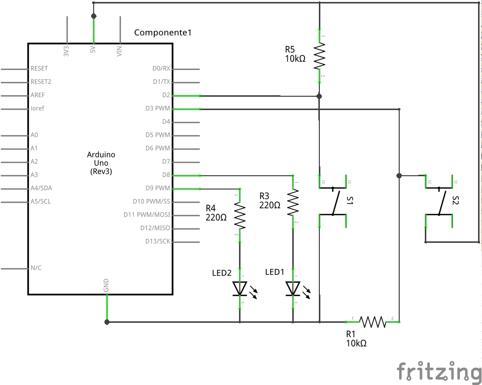
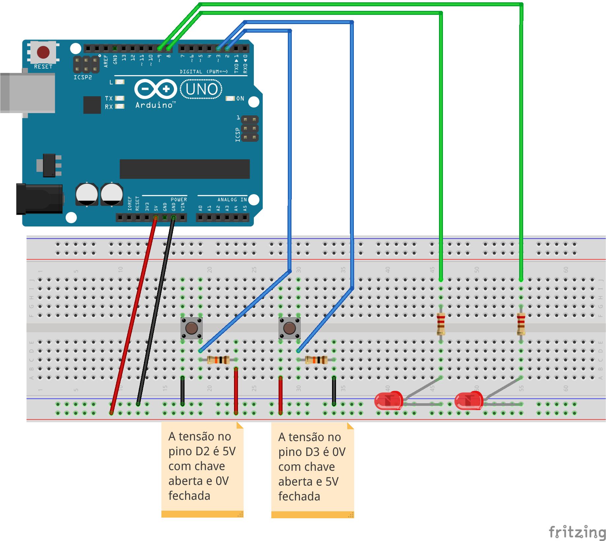

# ESTE: General Purpose Input and Output (GPIO)

This experiment is part of [ESTE Project](https://www.github.com/arliones/este).

This experiment is based on contents of [this UFSC project](http://www.lisha.ufsc.br/teaching/quark/).

Here we are going to build an experiment with an led and a push button to learn and start using the GPIO. GPIO is called General Purpose Input/Output, and it is basically a group of pins responsable of the communication of input and output digital signals in one board. So the exercise proposed is to turn on and off a led when the push button is pressed or not, respectively.

## Pseudo code

Let's begin with a solution. The pseudo code (actual coding is up to you) is below:

``` c
int main(void) {
    led_off();
    while(1) {
        if (push_button) {
            led_on();
        }
        else {
            led_off();
        }
    }
    return 0;
}     
```

This pseudo-code has a comparison statement to see if the push button is pressed (1) or not (0). If yes, the led will turn on and if not (else), the led will stay turned off.

## Schematic



## Part List

  - 2 LED
  - 2 Push buttons
  - 2 10k ohm resistors to the buttons
  - 2 220 ohm resistors to the leds
  - 1 Protoboard
  - 8 copper wires (tinned) or jumpers

## Assembly



## Solutions

  - [C - AVR](c_avr/)
  - [Arduino UNO](arduino/)

## Tools

  - AVR GCC and tools
  - Arduino IDE
