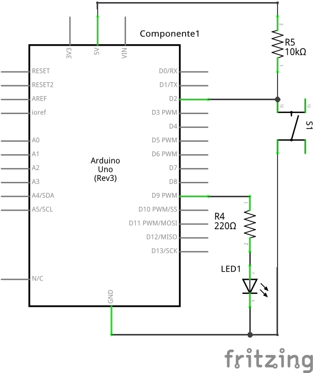

# ESTE: GPIO and External Interrupts - part 1

This experiment is part of [ESTE Project](https://www.github.com/arliones/este).

Here we are going to build an experiment with an LED and a push button, using the GPIO to consolidate the concepts of interrupts. A interrupt is an action performed by the microcontroller that allows itself to stop running the current program and immediately answer the device requesting the interruption by calling a pre-programmed routine (the interrupt vector). There are two types of interrupt requests: those called from the hardware (external signal) and those generated by the software (programming code). At this moment we are going to work with the external interrupts. Before we begin it is essential to know that external interrupts are called by hardware components, whose signal generated (HIGH and LOW) varies very fast. In order to perform an interrupt call that is regular and accurate, the signal must undergo a treatment that is basically the determination of a time limit to regularize the signal call. This treatment is called debouncing.

The exercise proposed here is to turn on and off an LED each time we press the push button. To complete this experiment it is recommended to see the [GPIO](../basic/) experiment.

## Pseudo code

Let's begin with a solution. The pseudo code (actual coding is up to you) is below:

``` c
interrupt_source = 0;        //you can select two interrupt sources: 0 (pin 2) and 1 (pin 3)
led_state = 0;               //state = 0, LED is off; state = 1, LED is on
debounce_limit = 200;        //limit time in ms between interrupts to debounce the electric signal
sensitivity = HIGH;          //select signal event that generates interrupt (SIGNAL_HIGH, SIGNAL_LOW, SIGNAL_CHANGE, RISING_EDGE, FALLING_EDGE)

int main(void)
{
    setup_interrupt_signal();

    while(1)
    {
        led_value(led_state);
    }
}     

void interrupt_handler()
{
    if (debounce())
    {
        led_state = !led_state;
    }
}

int debounce()
{
    //debounce() responsible for stabilizing the interrupt requests

    if( (now - time_last_accepted_interrupt) > debounce_limit)
    {
        time_last_accepted_interrupt = now;
        return 1;
    }
    else
    {
        return 0;
    }
}
```

This pseudo-code always send a led_state to the LED so that it sets the brightness acording to the states on and off. When the signal in the selected ''interrupt_source'' has the value defined by ''sensitivity'', the microcontroller generates an interrupt that is handled by the function ''interrupt_handler''. To truly perform a LED change, i.e the ''interrupt_handler'', it is necessary to check if the ''debounce'' was done correctly, because the debounce will treat all the calling signals to the interrupt - commonly several calls every time a push button is pressed - so that they stay regular. After the treatment of the interrupt signals, the ''led_state'' will be changed, varying between on and off.

## Schematic



## Part List

  - 1 LED
  - 1 push button
  - 1 10k ohm resistor to the button
  - 1 220 ohm resistor to the LED
  - 1 Protoboard
  - 5 copper wires (tinned) or jumpers

## Assembly


## Solutions

  - [C - AVR](c_avr/)
  - [Arduino UNO](arduino/)

# Tools

  - AVR GCC and tools
  - Arduino IDE

# References
  - [HumanHardDrive - Video tutorial: Arduino and external pin interrupts](https://www.youtube.com/watch?v=bmPKQzpnCeU)
  - [Arduino Reference: attachInterrupt()](https://www.arduino.cc/en/Reference/AttachInterrupt)
  - [Stackexchange: correlated problems solving](http://robotics.stackexchange.com/questions/2063/unable-to-read-pushbutton-press-properly-in-arduino)
  - [Davidorlo: Arduino - Interrupt Tutorial with LED & Switch](http://davidorlo.com/articles/arduino/arduino-%E2%80%93-interrupt-tutorial-with-led-switch)
  - [Instructables: Arduino - Software debouncing](http://www.instructables.com/id/Arduino-Software-debouncing-in-interrupt-function/)
  - [Sparkfun: Processor Interrupts with Arduino](https://www.sparkfun.com/tutorials/326)
  - [Engblaze: Arduino interrupts](http://www.engblaze.com/we-interrupt-this-program-to-bring-you-a-tutorial-on-arduino-interrupts/)
  - [Gonium: Handling external Interrupts with Arduino ](http://gonium.net/md/2006/12/20/handling-external-interrupts-with-arduino/)
  - [Embedds: Implementing AVR interrupts](http://www.embedds.com/implementing-avr-interrupts/)
  - [Embedds: Basic understanding of microcontroller interrupts](http://www.embedds.com/basic-understanding-of-microcontroller-interrupts/)
