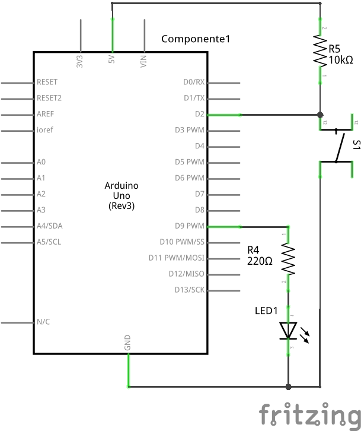
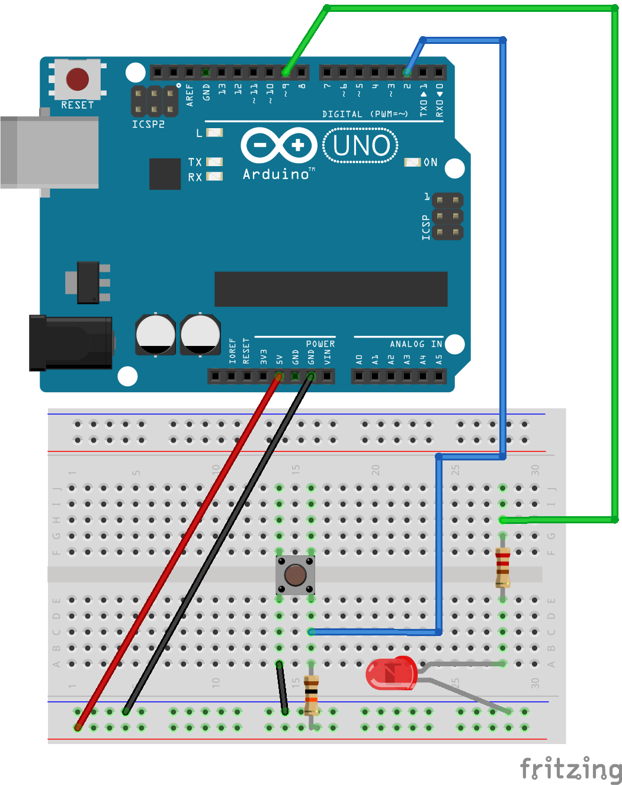

# ESTE: GPIO and External Interrupts - part 2

This experiment is part of [ESTE Project](https://www.github.com/arliones/este).

Here we are going to build another experiment with an LED and a push button, using the GPIO to consolidate concept of interrupts. The exercise here is to turn on an LED when a push button is pressed and off when the button is released. To complete this experiment it is recommended to see first the [GPIO](../basic/) and [External Interrupts - part 1](../interrupt1/) experiments.

# Pseudo code

Let's begin with a solution. The pseudo code (actual coding is up to you) is below:

```c
interrupt_source = 0;       //you can select two interrupt sources: 0 (pin 2) and 1 (pin 3)
led_state = LOW;              //state = 0, LED is off; state = 1, LED is on
debounce_limit = 200;       //limit time in ms between interrupts to debounce the electric signal
sensitivity = HIGH;         //select signal event that generates interrupt (SIGNAL_HIGH, SIGNAL_LOW, SIGNAL_CHANGE, RISING_EDGE, FALLING_EDGE)
button_state = LOW;           //to check exactly if it is happenig a RISING_EDGE or a FALLING_EDGE

int main(void)
{
    while(1)
    {
        led_value(led_state);
    }
    return 0;
}     

void interrupt_handler()
{
    if (debounce())
    {
        if (button_state == HIGH)
        {
            led_state = HIGH;         //if the button is pressed, the LED is on
        }
        else
        {
            led_state = LOW;          //if the button isn’t pressed anymore,  the LED is off
        }
    }
}

int debounce()
{
    //debounce is the function responsible for stabilizing the interruption requests

    if( (now - time_last_accepted_interrupt) > debounce_limit)
    {
        time_last_accepted_interrup = now;
        return 1;
    }
    else
    {
        return 0;
    }
}
```

This pseudo-code always send a led_state to the LED so that it sets the brightness acording to the states on and off. When the microcontroller detects a special "moment", it will call the function specified to a certain type_interrupt (each type of interruption can call only one function or perform one determinated action). To truly perform the led_change() it is necessary to check if the debounce() was done correctly, because the debounce will treat all the calling signals to the interruption - commonly more then thousands calls for each second in a push button -  so that they stay regular. After the treatment of the interrupt signals, it will be checked if the button is still pressed or not. If yes we turn the LED on, if not the LED will be turned off.

# Schematic



# Part List

  - 1 LED
  - 1 push button
  - 1 10k ohm resistor to the button
  - 1 220 ohm resistor to the LED
  - 1 Protoboard
  - 5 copper wires (tinned) or jumpers

# Assembly


# Solutions
  - [C - AVR](c_avr/)
  - [Arduino UNO](arduino/)

# Tools
  - AVR GCC and tools
  - Arduino IDE
